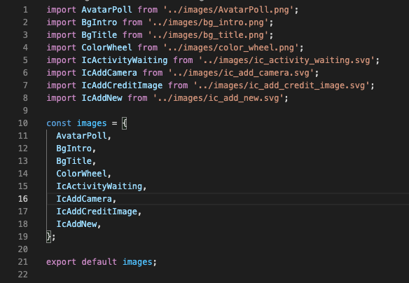

# **Project: Auto Import Images**

As mentioned in the title, we're going to implement a way to auto import all images in the project's folder.
### Result Example image


## STEP 1: check image format (jpg, jpeg, png, svg) and delete all exception
## STEP 2: Install libraries svg to display
```
 install: yarn add react-native-svg && react-native-svg-transformer
```

### (Optional) Using TypeScript you must declare type

create file in `declarations.d.ts` in root project :

```
declare module '*.png' {
  const content: number;
  export default content;
}
declare module '*.jpg' {
  const content: number;
  export default content;
}
declare module '*.svg' {
  import {SvgProps} from 'react-native-svg';

  const content: React.FC<SvgProps>;
  export default content;
```

## Explain code generation:

run: 
```
node autoImportSvg.js
```
result to auto generate in file `./src/asset/images/index.tsx`;

read all file in folder and check type file by regular express.
```js
let imagesList = fs
  .readdirSync('./src/asset/images', {withFileTypes: true})
  .filter(item => !item.isDirectory())
  .map(item => item.name);

  let imageType = /(\.jpg|\.jpeg|\.png|\.svg)$/i;
  image.match(imageType)
```
concat all data from `imagesList` with format `import BgTitle from '../images/bg_title.png';` then write to file output `./src/asset/images/index.tsx`

```js
imagesList.forEach(function (image) {
  if (image.match(imageType)) {
    let removeSpecial = image.replace(/[^a-zA-Z ]/g, ' ');
    let addUpper = removeSpecial
      .split(' ')
      .map(word => word.charAt(0).toUpperCase() + word.slice(1));
    let joinText = addUpper.join('');
    importText += `import ${joinText.substring(
      0,
      joinText.length - 3,
    )} from '../images/${image}';\n`;
    constant += ` ${joinText.substring(0, joinText.length - 3)},\n`;
  }
}); 

createImgIndex.write(importText);
createImgIndex.write(`\nconst images = { ${constant} }\n`);
createImgIndex.write('\nexport default images');
createImgIndex.end();
```


[//]: #Reference
[documentation]: <https://reactnative.dev/docs/environment-setup>